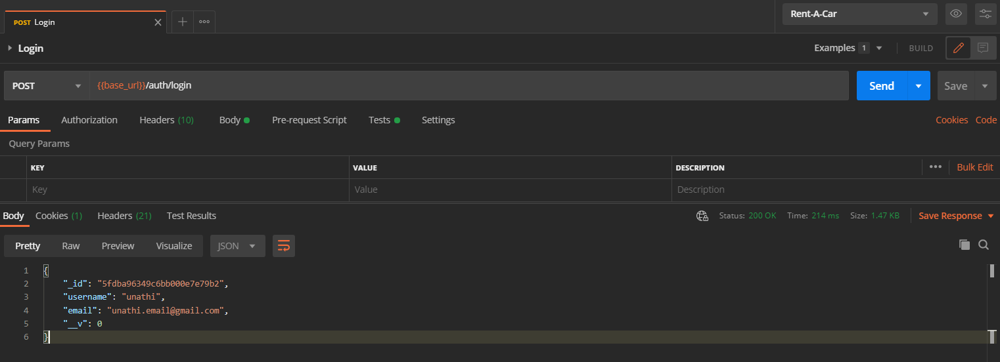

# Rent A Car API
[Rent-a-car](https://github.com/Pioneer18/Rent-A-Car) is a demonstrative peer-to-peer car rental application. A user is able to search for car rentals in a radius near their location or a selected address, as well as list and manage their own rentals. This application was built with a [NestJS](https://nestjs.com) backend.

### Quick Start
To quickly get started with a tour of the application, please follow this guide

##### **Logging In to the Applicaiton**
The first step to using the Rent-A-Car API is to login to the application. You may use one of the premade accounts below, or create a new account to being. To create a new account use the **User Module - Create User** request. Once you have created or selected an account, open the **Auth Module** and select the **login** request to enter your selected account credentials. A successful request will return the created profile data in the response

